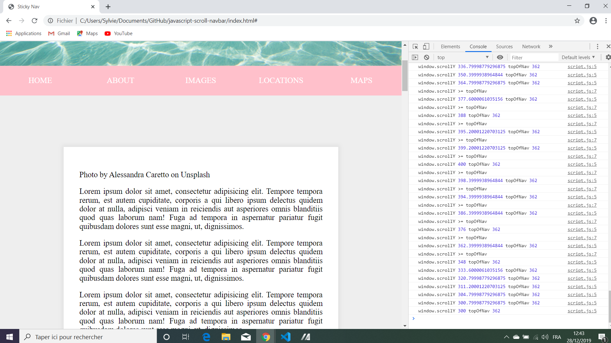

# :zap: Javascript Scroll Navbar

* Wes Bos Youtube Tutorial: [Vanilla JavaScript Sticky Nav - #JavaScript30 24/30](https://www.youtube.com/watch?v=5FLOBCGH3_U&list=PLu8EoSxDXHP6CGK4YVJhL_VWetA865GOH&index=24).

*** Note: to open web links in a new window use: _ctrl+click on link_**

## :page_facing_up: Table of contents

* [General info](#general-info)
* [Screenshots](#screenshots)
* [Technologies](#technologies)
* [Setup](#setup)
* [Features](#features)
* [Status](#status)
* [Inspiration](#inspiration)
* [Contact](#contact)

## :books: General info

* Tutorial Code to add a class to change the nav bar when the user scrolls up. Also changes the width of the text div.

## :camera: Screenshots

.

## :signal_strength: Technologies

* [Javascript v1.9 ECMA-262 ECMAScript 2018](http://www.ecma-international.org/publications/standards/Ecma-262.htm)

## :floppy_disk: Setup

* Open index.html in browser. If any code is changed the browser needs to be refreshed.

## :computer: Code Examples

* compares scroll position with top of Navigation and adds the 'fixed-nav' class when they are equal.

```javascript
fixNav = () => {
  console.log('window.scrollY', window.scrollY, 'topOfNav', topOfNav);
  if(window.scrollY >= topOfNav) {
    console.info('window.scrollY >= topOfNav');
    document.body.style.paddingTop = nav.offsetHeight + 'px';
    document.body.classList.add('fixed-nav'); 
  } else {
    document.body.style.paddingTop = 0;
    document.body.classList.remove('fixed-nav'); 
  }
}
```

## :cool: Features

*  At about scrollY = 337px the css class change occurs to 'fixed-nav'.

## :clipboard: Status & To-Do List

* Status: Working.
* To-Do: nothing

## :clap: Inspiration

* Wes Bos Youtube Tutorial: [Vanilla JavaScript Sticky Nav - #JavaScript30 24/30](https://www.youtube.com/watch?v=5FLOBCGH3_U&list=PLu8EoSxDXHP6CGK4YVJhL_VWetA865GOH&index=24)

## :envelope: Contact

* Repo created by [ABateman](https://www.andrewbateman.org) * you are welcome to [send me a message](https://andrewbateman.org/contact)
